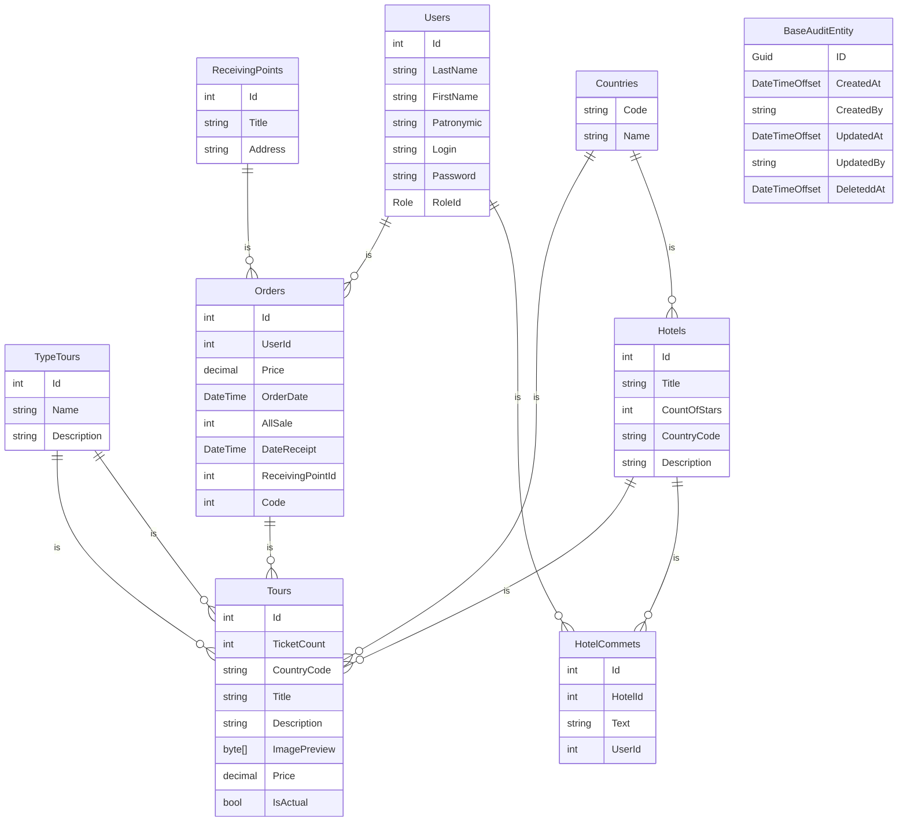
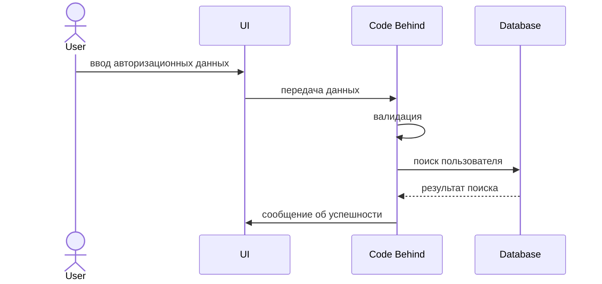

# ToursDemo
Меньшиков Данила Александрович ИП-20-3  
Тема задания: Заказ туров

## Схема базы данных

```mermaid
erDiagram

    Users {
        int Id
        string LastName
        string FirstName
        string Patronymic
        string Login
        string Password
        Role RoleId
    }

    Countries {
        string Code
        string Name
    }

    TypeTours {
        int Id
        string Name
        string Description
    }
    
    Hotels {
        int Id
        string Title
        int CountOfStars
        string CountryCode
        string Description
    }
    
    HotelCommets {
        int Id
        int HotelId
        string Text
        int UserId
    }

    ReceivingPoints {
        int Id
        string Title
        string Address
    }

     Tours {
        int Id
        int TicketCount
        string CountryCode
        string Title
        string Description
        byte[] ImagePreview
        decimal Price
        bool IsActual
    }

     Orders {
        int Id
        int UserId
        decimal Price
        DateTime OrderDate
        int AllSale
        DateTime DateReceipt
        int ReceivingPointId
        int Code
    }
    Countries ||--o{ Hotels: is
    Countries ||--o{ Tours: is
    TypeTours ||--o{ Tours: is
    Hotels ||--o{ HotelCommets: is
    Users ||--o{ HotelCommets: is
    Users ||--o{ Orders: is
    ReceivingPoints ||--o{ Orders: is
    Hotels ||--o{ Tours: is
    TypeTours ||--o{ Tours: is
    Orders ||--o{ Tours: is

  BaseAuditEntity {
        Guid ID
        DateTimeOffset CreatedAt
        string CreatedBy
        DateTimeOffset UpdatedAt
        string UpdatedBy
        DateTimeOffset DeleteddAt
  }
```

```mermaid
sequenceDiagram
actor U as User
participant UI
participant CB as Code Behind
participant DB as Database
U->>UI:ввод авторизационных данных
UI->>CB:передача данных
CB->>CB:валидация
CB->>DB:поиск пользователя
DB-->>CB:результат поиска
CB->>UI:сообщение об успешности
```

